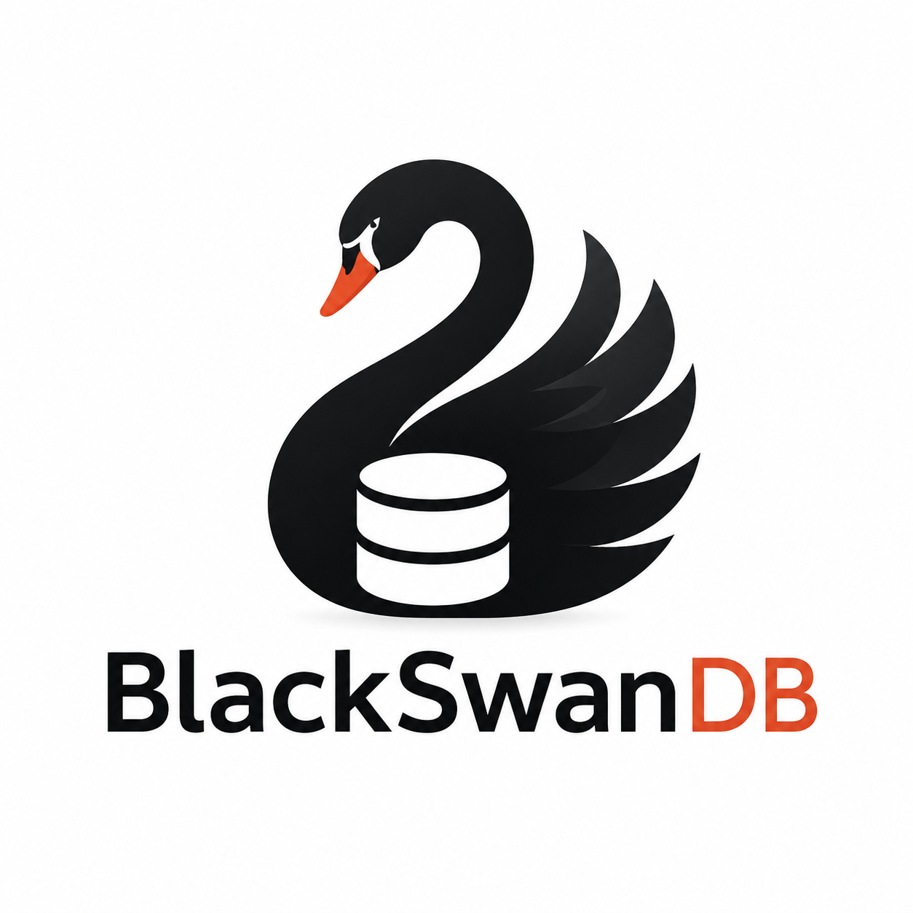

# BlackSwanDB



**BlackSwanDB** is a lightweight Python library that combines the simplicity of **Pandas**, the performance of **DuckDB**, and the efficiency of **Apache Parquet**.

Its goal is to provide a simple API to manage collections of datasets stored as Parquet files without requiring a traditional database server.

:warning: THIS IS AN ALPHA VERSION, PROBABLY FULL OF BUG :warning:

---

## Features

* 📁 Store one dataset per Parquet file.
* 🚀 Fast querying powered by DuckDB.
* 📊 Read only the columns you need.
* 🔄 Incrementally update datasets from:

  * Excel (`.xls`, `.xlsx`)
  * CSV (`.csv`)
  * TXT (`.txt`)
  * DAT (`.dat`)
* 🧹 Automatic duplicate removal.
* 🐍 Simple Python API.
* 💾 No database server required.

---

## Installation

```bash
pip install blackswandb
```
or, from the repository:

```bash
pip install -e .
```

---

## Project Structure (example)

```
BlackSwanDB/
│
├── blackswan/
│   ├── database.duckdb
│   └── parquet/
│       ├── pokemon_archive-1.parquet
│       └── pokemon_archive-2.parquet
```

Each Parquet file represents a single dataset.

The filename (without extension) becomes the dataset **key**.

---

## Quick Start

```python
from blackswandb import BlackSwanDB

db = BlackSwanDB("./blackswan")
```

List available datasets:

```python
db.keys()
```

Example output:

```python
['pokemon_archive-1', 'pokemon_archive-2']

```

Show available columns ( :no_entry: to fix):

```python
db.columns()
```

Read data:

```python
df = db.select(
    columns=["Date", "Close"],
    keys=["AAPL", "MSFT"]
)
```

Filter rows:

```python
df = db.select(
    columns=["Date", "Close"],
    keys=["AAPL"],
    where="Close > 100",
    order_by="Date DESC",
    limit=100
)
```

Run a custom SQL query:

```python
df = db.sql("""
SELECT
    key,
    AVG(Close) AS avg_close
FROM data
GROUP BY key
ORDER BY avg_close DESC
""")
```

---

## Updating the Database

Import new files from a directory:

```python
db.update("folder_with_new_data")
```

Supported formats:

* `.xls`
* `.xlsx`
* `.csv`
* `.txt`
* `.dat`

If a dataset already exists, BlackSwanDB:

1. Loads the existing Parquet file.
2. Loads the new data.
3. Merges both datasets.
4. Removes completely duplicated rows.
5. Saves the updated Parquet file.

Example:

```python
db.update(
    "./incoming",
    keep="last"
)
```

`keep` follows the same behavior as `pandas.DataFrame.drop_duplicates()`.

---

## Metadata

Number of rows:

```python
db.count()
```

Dataset schema:

```python
db.schema()
```

Summary statistics:

```python
db.describe()
```

First rows:

```python
db.head()
```

---

## Example

```python
from blackswandb import BlackSwanDB

with BlackSwanDB("./blackswan") as db:

    db.update("./incoming")

    print(db.keys())
    print(df.head())
```

---

## Roadmap

### Version 0.1

* DuckDB backend
* Parquet storage
* Dataset updates
* Duplicate removal
* SQL interface
* Simple Python API

### Planned Features

* Automatic delimiter detection
* Automatic encoding detection
* Parallel imports
* Metadata cache
* Polars support
* Partitioned Parquet datasets
* Dataset statistics
* Logging
* Incremental indexing

---

## Requirements

* Python 3.10+
* DuckDB
* Pandas
* PyArrow

---

## License

MIT License.

---

## Contributing

Contributions, bug reports and feature requests are welcome.

If you have ideas or improvements, feel free to open an issue or submit a pull request.
